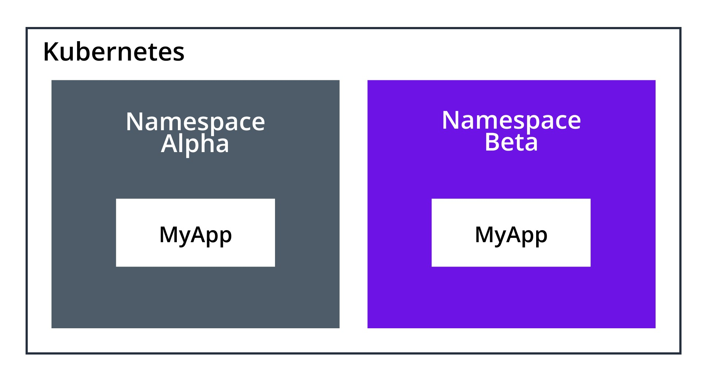

Kubernetes has a concept called Namespaces.

It's a logical way of splitting workloads and objects.

It is possible to apply security policys on Namespaces, do prevent access between them, but for this lesson, threat them more like folders, on your computer, rather than seperate servers (if that makes sense)

In the last module, we deploy everything in the `default` Namespace.

This happens, when we don't define a Namespace, in our deployment.

To see the namespaces in our cluster run
```execute
kubectl get ns
```
ns is short for Namespace

The output should be 
```
NAME              STATUS   AGE
default           Active   15m
kube-system       Active   15m
kube-public       Active   15m
kube-node-lease   Active   15m
```

To create a new namespace simply run
```execute
kubectl create ns test
```
Run
```execute
kubectl get ns
```
To see your new namespace
```
NAME              STATUS   AGE
default           Active   16m
kube-system       Active   16m
kube-public       Active   16m
kube-node-lease   Active   16m
test              Active   3s
```

To deploy the app from before in the new namespace run
```execute
kubectl apply -f pod.yaml -n test
```

You new have to run 
```execute
kubectl get pods -n test
```
to see the new pods, since we deleted the privius one in the default namespace.

To delete it again, you also have to add the -n option
```execute
kubectl delete -f pod.yaml -n test
```

It's also possible to add the namespace value, directly in the yaml file.
This is done by adding 
```
namespace: test
```

under metadata, so the pod.yaml file would look like this
```
apiVersion: v1
kind: Pod
metadata:
  name: nginx
  namespace: test
spec:
  containers:
  - name: nginx
    image: nginx:latest
    ports:
    - containerPort: 80
```

---
**Talk in class about**
- When to use namespaces
- Security
- etc
---
