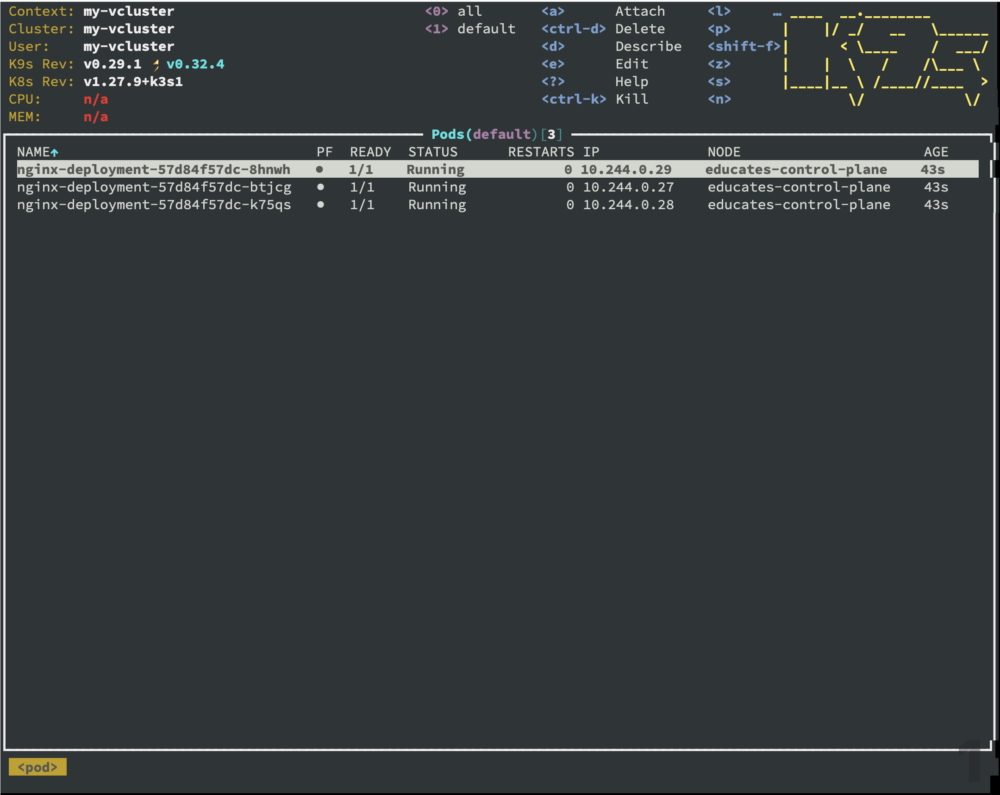
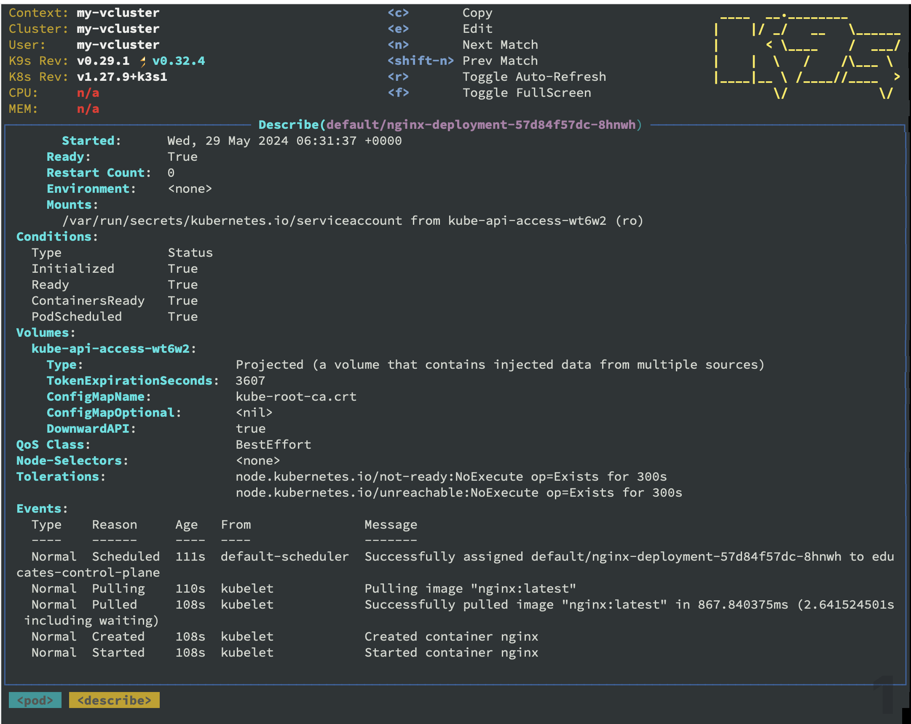
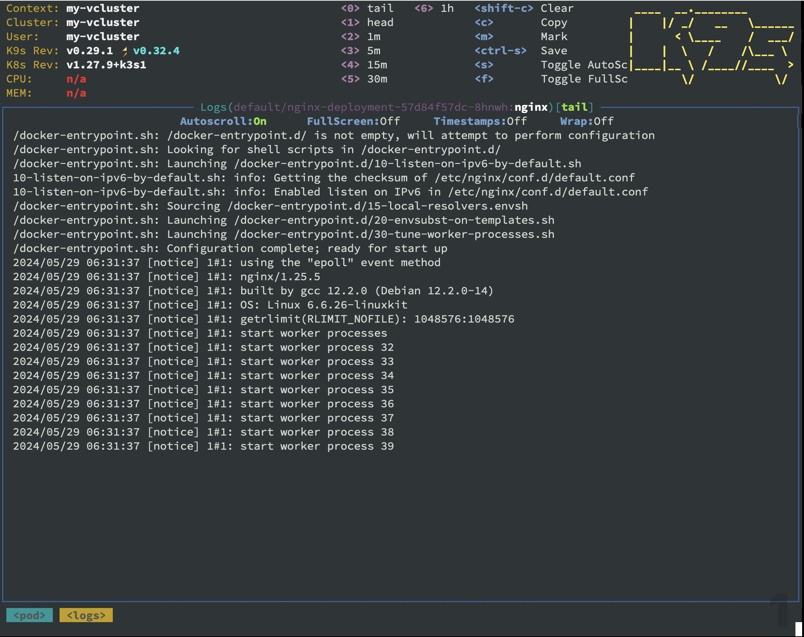
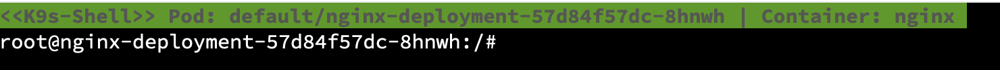
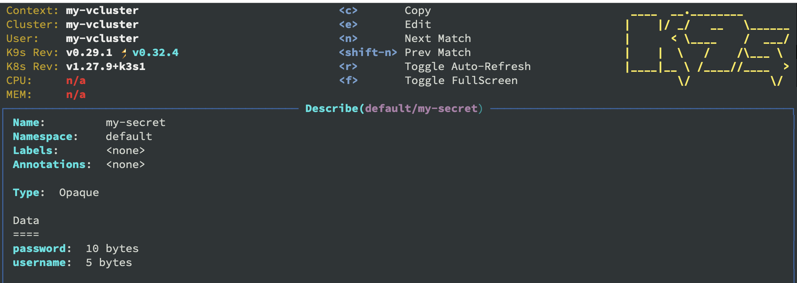

In this lab, we have focused on Kubectl, as the tool to manage Kubernetes.

It's without a doubt the most used tool, and the one you should learn to be most comfortable with.

But Kubernetes also have other 3 party tools, that can help you do things a bit easier.

## K9S
[K9S](https://k9scli.io) is a Terminal based UI, that can make it easier to see all the different objects in your kubernetes cluster.

Before we begin, let's make sure we got a couple of pods deployed, by running
```execute
kubectl apply -f deployment.yaml
kubectl apply -f secret.yaml
```


To open K9S type 
```execute
k9s
```



We won't go into debt about all the functionality.
But there is a couple I would like to show,

### Description

The first ting we will look at, is how to get a description of an object.

Select one of the `Nginx-deployments` and then press `d` to describe it.

you can now see all the details around that object.



To exit to the main page press `esc`


### Logs

Logs works the same way.

Select one of the `Nginx-deployments` and then press `l`

You will now see the logs from that pod.



This is really usefull, when you are trubleshooting, and want to see what's going on inside a pod.

To exit simply press `esc`

### Shell

To get a shell, select one of the `Nginx-deployments` and then press `s`

You now have a terminal inside the pod, where you can run your commands, and trubleshoot.



To exit type `exit`

### Custom objects

To find other objects type `:`and then type the name of the object you want to find. 

Let's try it, by typing `secrets` and press `enter`

Select the secret, and type `d` to see the details of the secret.



Exit by pressing `esc`

There are many more things you can do with K9S, but that is outside the scope of this lab.

## Kind

[Kind](https://kind.sigs.k8s.io) is a solution for running Kubernetes in docker.

You might ask, why you want to do that. 

But for testing and learing about Kubernetes, it can be an really usefull tool to have in your toolbox.

It runs localy on your computer, and it can spin up a cluster in seconds.


---
**Talk in class about**

- K9S
- kind
- Carvel tools
- [https://collabnix.github.io/kubetools/](https://collabnix.github.io/kubetools/)

---